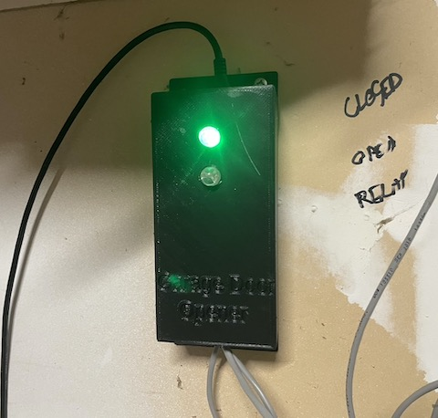
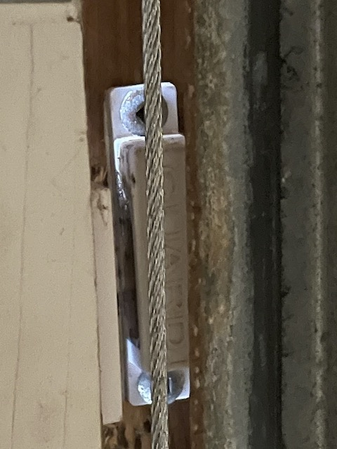
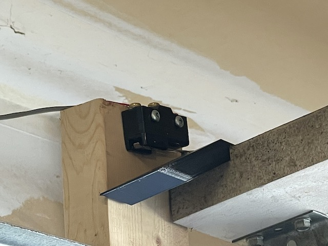

# ESP32 GarageDoor Controller for HomeKit

## What is it

ESP32 dedicated Garage Door controller. When Espressif, created their Homekit SDK for the ESP32, the time was ripe to move the garage door controller to a smaller platform. The ESP32 IDF and Homekit SDKs made incorporating homekit functionity into a sample platform easy.
## How this Works

Because this is based on the open source version the Espressif SDK, it is not possible to automatically transfer the WIFI creds over the HAP connection. While auto-provisioning of the WIFI creds can be used it was overkill for the one garage door in my home. This module uses my WIFI component to hard code the WIFI creds into the device. It then starts up the Homekit SDK and allows the device to be auto-provisioned in the Apple Home App.

The garage door software uses three GPIO pins on the ESP32:

- GPIO 26 for the relay
- GPIO 25 for the close sensor
- GPIO 27 for the open sensor

The relay should be a buffered relay board. You can find them on Aliexpress or elsewhere.

The difference with this controller is it uses both a switch on the lower part of the door to sensor it's actually closed and a switch on the upper side of the door to sensor it's actually open. With only a close switch, one can only assume the garage door actually makes it all the way up to be open. The two switches allow us to add a motion sensor service to sensor when the door is in motion. I use that to turn the garage light automatically on when the door moves.

The code configures the following services that make up the garage door accessory:

- Garage Door
- Close Sensor
- Open Sensor
- Motion Sensor (sense when the door is in motion)
- Switch to force the door to move (used for automations to override security "issues")
- Switch to close the door when it is open (and only open). Homekit sometimes loses the door status and this control is required for automation to work reliably.

What is missing from this unit is the obstruction detection. At some point, I may add a eye beam to detect something is in the way, but the old garage door already has that as a safety features, so having your phone notify you of the obstruction seems moot.

The code uses a button library to monitor the door switches and automatically debounces the switches. Additionally, the routine the monitors the open and close switches updates Homekit with the changes in status, so the home app almost instantly. However, Homekit seems to have a bug in it where if you control the door without using the Home App, it loses track of the door status. The code updates the status correctly, but Homekit seems to ignore it. That said, it does correct itself when the door is fully closed.

For my device, I included two LED's connected to the switches through resistors. There is no GPIO for these and they are completely optional. I had issues with the door switches not working. During the winter, ice built up on the bottom of the door, and the close switch needed to be repositioned. Include them if you want, but they are not required.

## Printing a Case

I've included a OpenSCAD model for the case I used. This includes the protoboard I used from Sayal Electronics (http://sayal.com). However, you can use any board. The open scad model allows you to adjust the location of the screw mounts for your protoboard and relay board. I also included the model for the roller switch block I ended up using. I found my roller switch wouldn't work sometimes when the garage door would change where it stopped. The block caused it to always work. Again, this isn't strictly required.
## Setting up the Device

This project is based on the ESP-IDF.

Make sure to run the updatemodules.sh script if you did not get the code recursively. It has a dependancy on the Espressif HomeKit SDK, my own WIFI module, and my modified button module orginally from craftmetrics/esp32-button.

First, configure idf with menuconfig:

```bash
idf.py menuconfig

Make sure to set the GPIO pins to what you intend to use. Also, use the hard coded Homekit code, but make sure there are no duplicates on your network. WIFI is configured manually. Under the WIFI menu add your WIFI creds. Two are supported in case you have two SSIDs. The reconnect timeout of 8 secs is sufficient. The reboot count of 100 is also good. This will cause the ESP32 to reboot when it hits 100 WIFI connect retries. For the button configuration, there is a 2 second delay on the RESET button. Change this to 5 seconds or whatever. When the devices reset button is held for x secords, the homekit setup is wiped, and the device restarted. This is required to move the device to another homekit installation or to reset the device from scratch.

Flash and run the monitor:

```bash
idf.py flash
idf.py monitor
```

The easiest way to setup Homekit is to use the USB cable and the ESP-IDF monitor. This allows you to see the QR code generated in the log. Unlike production Homekit devices, there is no way to autoprivision the WIFI password through homekit. While it is possible, it requires a Homekit license from Apple and the MFi from Espressif. For home use, the hard coded WIFI credentials is usually good enough.

With the monitor running, you will get a screen full of data and a QR code. The first QR code is for homekit. If you mess up anything, hold the boot button down for 10 seconds to wipe the configuration, and start over. Open the Homekit app on your iPhone, and add an accessory. Scan the first QR code with Home app, and it should find the GarageDoor accessory. At this point, it's fairly quick to add the accessory. Because of all the different sensors in this device, it's a good idea to use "separate tiles" to display them. Open the setting for the garage door item in the Home app, and select the separate files item.

That is it. You can now use the Home app or Siri to control the device. The default names are ESP "item name". You can change them on your Home app.

## Circuit

Issue #1 describe the circuit. I never created a schematic because it literally is nothing more than a ESP32, a relay, and two switches. However, for those who are not so electronics inclined, I've add a description below:

I used a ESP32 DevKitC v4 from Aliexpress, but you can buy them anywhere. DigiKey has them if you want it tomorrow. There is one switch mounted at the top of the garage door (door open sensor) and one switch near the bottom of the door (door closed sensor). They are wired directly to the associated GPIO on the ESP32 devkit board. No capacitors or resistors are required because switch debounce is done in software. The switches are active low, so the other side of the switches go to ground on the ESP32. I used a reed switch for the top of the door and a magnetic door close switch for the bottom of the door which I found locally at a hobby electronics shop.

The relay board takes another GPIO - mine is a 5v relay board, so I wired the 5v line to the 5v line on the ESP32, and ground to the ESP32 ground, and the data line to the ESP32 GPIO. Lots of these are on Alliexpress, but my favourite supply shop locally had them. The other side of the relay board uses the N/O connections to connect to the garage door switch - so it takes the place of a human. The relay is toggled for about 400ms. I suggest wiring everything on a breadboard first, and get it working. I used a set of dip switches to similar the door switches for testing.

I power the device from the USB port from a cheap USB power supply which is plugged into the wall in my garage.

If you want to connect the LED's as I have, connect one side if the LED to 5V through a 100ohm resistor, and the other side to the door switch (or to your protoboard). When the switch closes, it will activate the LED and the GPIO.

## Photos

Below are some of the photos from the device I created.




